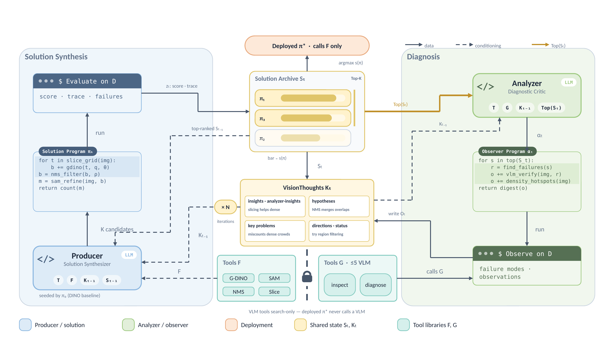

# VTOS: Learning to Orchestrate Vision Tools by Co-Searching Solutions and Observers

Code for the EMNLP 2026 paper [arXiv:2606.20728](https://arxiv.org/abs/2606.20728).

## 🌟 Overview

VTOS searches over vision programs composed of vision foundation tools (e.g., Grounding DINO,
SAM, NMS, and slice-and-detect). During search, an LLM Producer generates candidate programs, an
LLM Analyzer writes observer programs that diagnose failure modes of top-performing candidates,
and their findings accumulate into a shared knowledge base across iterations. Search is
conducted on the training set, program selection on the validation set, and evaluation on the
test set is performed exactly once.



## ⚙️ Setup

```bash
conda create -n vtos python=3.10 -y
conda activate vtos
pip install -r requirements.txt
```

Vision models are downloaded from Hugging Face on first use:
`IDEA-Research/grounding-dino-tiny`, `facebook/sam-vit-base`, `facebook/sam2-hiera-large`,
`openai/clip-vit-large-patch14`.

Search calls an LLM through OpenRouter (used in the paper), Poe or OpenAI. Save your key
locally (`keys/` is git-ignored), or set `OPENROUTER_API_KEY` instead:

```bash
mkdir -p keys && echo "<your-openrouter-key>" > keys/key.txt
```

## 📦 Data Preparation

Both benchmarks are on Hugging Face ([tic26/VTOS-Bench](https://huggingface.co/datasets/tic26/VTOS-Bench)):
60 train / 20 val / 100 test images each; LVIS-Count categories and PlantSeg-OOD
species/diseases are disjoint across splits.

```bash
python -m tools.download_data
```

```
data/tasklets/
├── lvis_count/     benchmark_{train,val,test}.json  images/
└── plantseg_ood/   benchmark_{train,val,test}.json  images/
```

## 🚀 Quick Start: Evaluate the Searched Programs

`programs/` holds the two searched programs reported in the paper. Each is scored on the test
split directly, without search or LLM calls.

```bash
# LVIS-Count
python -m eval.run_program --task lvis_count --code-file programs/lvis_count_sol_012_00.py
# PlantSeg-OOD
python -m eval.run_program --task plantseg_ood --code-file programs/plantseg_ood_sol_004_01.py
```

## 🔍 Search

To search for new programs from scratch.

### LVIS-Count

```bash
# with the Analyzer
python -m eval.vtos_runner --exp_id analyzer_on --split test --n-iter 15 --k-proposals 3 \
    --analyzer-mode on --score-mode dual_rank \
    --provider openrouter --llm-model anthropic/claude-sonnet-4.6
# without the Analyzer
python -m eval.vtos_runner --exp_id analyzer_off --split test --n-iter 15 --k-proposals 3 \
    --analyzer-mode off --score-mode point_f1 \
    --provider openrouter --llm-model anthropic/claude-sonnet-4.6
```

### PlantSeg-OOD

```bash
python -m vtos.runner.seg_orchestrator --exp-id vtos \
    --seed-code vtos/runner/seg_seed_grounded_sam2.py \
    --n-iter 5 --k-proposals 3 --n-train-eval 60 --analyzer-mode on --val-select-k 3 \
    --llm-provider openrouter --llm-model anthropic/claude-sonnet-4.6
```

## 📑 Citation

```bibtex
@inproceedings{ge2026vtos,
  title         = {{VTOS}: Learning to Orchestrate Vision Tools by Co-Searching Solutions and Observers},
  author        = {Ge, Jinchao and Liu, Lingqiao and Zhao, Shuwen and Wang, Lei},
  booktitle     = {Proceedings of the 2026 Conference on Empirical Methods in Natural Language Processing},
  year          = {2026},
  eprint        = {2606.20728},
  archivePrefix = {arXiv}
}
```

## 📜 License

MIT
